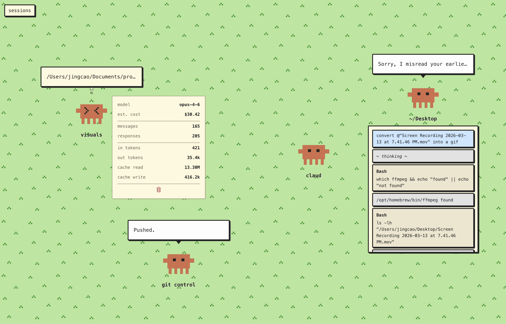

# clawd zoo

A localhost dashboard that monitors active Claude Code sessions in real time. Each session is represented by a pixel-art clawd bot that bounces, shakes, and blinks as Claude works.



## Install

Requires [Bun](https://bun.sh) and Node.js.

```bash
git clone https://github.com/jca0/clawd-zoo.git
cd clawd-zoo/clawd-zoo
npm install
cd ..
```

## Usage

```bash
bun run cli/index.ts
```

This will:
1. Install HTTP hooks into `~/.claude/settings.json`
2. Start the Next.js dev server on port 3000
3. Open the dashboard in your browser

Press Ctrl+C to stop. Hooks are automatically removed on exit.

## Features

- Click a clawd to view session stats (model, cost estimate, token counts, tool breakdown)
- Click a bubble to expand the full conversation history
- Drag clawds to reposition them
- Double-click a label to rename a session
